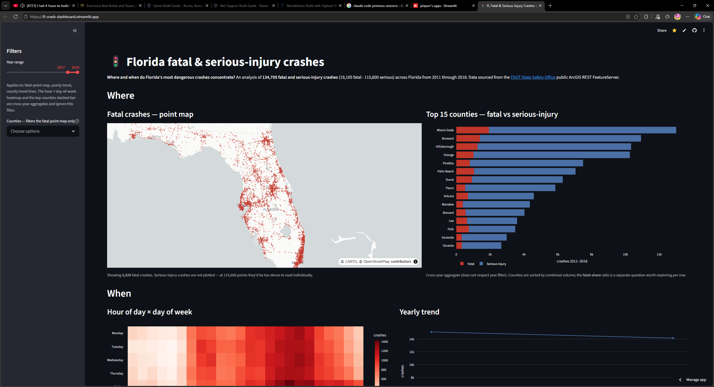

# Florida Crash Dashboard

[](https://fl-crash-dashboard.streamlit.app)

> Where and when do Florida's most dangerous crashes happen — and what does that pattern reveal about which counties, times, and conditions warrant attention?
>
> **→ Live dashboard: [fl-crash-dashboard.streamlit.app](https://fl-crash-dashboard.streamlit.app)** *(free Streamlit account required to view)*

## The question this project answers

**Primary question:** *Where and when do Florida's **fatal and serious-injury**
crashes concentrate?*

By filtering to fatal and serious-injury crashes (instead of all crashes),
the dashboard surfaces places that are genuinely dangerous rather than
just busy — a total-crash map of Florida looks essentially like a map of
where people live, which isn't useful.

**Supporting sub-questions:**
- *Where:* Which counties, cities, and road segments hold the largest
  share of fatal/serious-injury crashes?
- *When:* What are the dominant time-of-day, day-of-week, and seasonal
  patterns for those crashes?
- *Trend:* How has the where/when pattern shifted year over year
  (subject to the date range available from the API)?

## Data source

**FDOT State Safety Office** — public ArcGIS REST FeatureServer:
[`https://gis.fdot.gov/arcgis/rest/services/Crashes_All/FeatureServer`](https://gis.fdot.gov/arcgis/rest/services/Crashes_All/FeatureServer)

- **Coverage:** 2011 – 2019 (~3.3M total crashes statewide).
- **Analytical slice:** fatal + serious-injury crashes only
  (`INJSEVER IN ('4','5')`), ≈ **161,000 records** — the dashboard is
  scoped to genuinely dangerous outcomes, not all fender-benders.
- **Access:** open, no API key, no registration required.
- **Why not Signal Four Analytics:** the recent end of FL crash data
  lives there, but S4A is gated behind agency accounts and not
  accessible for a public portfolio project.

See [`docs/api_notes.md`](docs/api_notes.md) for the full layer / field
breakdown, severity-code mapping, pagination scheme, and a working
`curl` example.

## Pipeline

```
  FDOT / Signal Four Analytics API
                │
                ▼
       src/ingest.py  ──►  data/raw/      (immutable JSON / CSV pulls)
                                │
                                ▼
                       src/clean.py
                       (pandas: clean, type, dedupe)
                                │
                                ▼
                       DuckDB (*.duckdb)
                       sql/ aggregation queries
                                │
                                ▼
                       data/processed/    (per-view CSVs, committed)
                                │
                                ▼
                       Streamlit + Plotly dashboard
                       (hosted on Streamlit Community Cloud)
```

## Key findings

Four observations from the dashboard, each tied to a chart and a
concrete number rather than a vibe:

1. **Crash volume is heavily concentrated, but fatal risk isn't.**
   The five busiest counties (Miami-Dade, Broward, Hillsborough,
   Orange, Pinellas) hold **38.6%** of every fatal + serious-injury
   crash in the state. But none of those metros are the most
   *deadly per crash*: **Polk County's fatal share is 21.2%**,
   compared to Miami-Dade's 14.8% — a 42% higher per-crash fatality
   rate, despite Polk logging less than a third of Miami-Dade's
   volume. Marion (18.2%), Lee (17.6%), and Escambia (16.5%) also
   beat every top-5 metro on fatal share. *Rural and exurban
   counties are where crashes are more likely to kill.*

2. **Fatal crashes climbed faster than total severe crashes — and
   kept climbing after the total plateaued.** Statewide fatal +
   serious-injury crashes rose 40% from **13,342 (2011) → 18,705
   (2016)**, then slipped back to **~17,000 by 2018**. But fatal
   crashes specifically went from **1,709 → 2,815 over the same
   window — a 65% increase**, and 2018 had the most fatal crashes
   of any year in the data despite total volume falling. The fatal
   share of severe crashes shifted from **12.8% (2011) to 16.6%
   (2018)**.

3. **The afternoon rush is the most dangerous window of the day.**
   Hour 16 (4 PM) leads at **8,407 crashes**, with hours 15, 17,
   and 18 all over 8,000. The 4–7 PM block alone holds **32,150
   crashes** — nearly 4× the volume of the 3–6 AM lull (11,943)
   and meaningfully above the 7–9 AM morning commute (~5,500/hr).

4. **Weekend bump is real, but smaller than intuition suggests.**
   Friday is the busiest day (**20,772 crashes**) with Saturday
   close behind (20,554). Fri+Sat run about **13% above** the
   Mon–Thu baseline. Sunday is actually the *quietest* day
   (17,862) — undercutting the lazy "weekends are dangerous"
   narrative.

*(Scope: 134,705 fatal + serious-injury crashes statewide,
2011–2018. See [`docs/api_notes.md`](docs/api_notes.md) for source
and [`notebooks/01_eda.ipynb`](notebooks/01_eda.ipynb) for the EDA
that informed the cleaning + aggregation choices behind these
numbers.)*

## Live dashboard

**→ [fl-crash-dashboard.streamlit.app](https://fl-crash-dashboard.streamlit.app)**

Built with Streamlit + Plotly, hosted on Streamlit Community Cloud.
A free Streamlit account is required to view (Community Cloud policy);
sign-in is one click via GitHub or Google.

## How to reproduce

```bash
# 1. Clone
git clone <repo-url> fl-crash-dashboard
cd fl-crash-dashboard

# 2. Create and activate the virtual environment
python3 -m venv .venv
source .venv/bin/activate          # macOS / Linux
# .venv\Scripts\activate           # Windows

# 3. Install dependencies
pip install -r requirements.txt

# 4. Pull raw crash data → data/raw/
python src/ingest.py

# 5. Clean, load into DuckDB, export aggregated CSVs → data/processed/
python src/clean.py

# 6. Run the dashboard locally
streamlit run app.py
# Hosted version: https://fl-crash-dashboard.streamlit.app
```

## Tech stack

Python · pandas · DuckDB · SQL · Streamlit · Plotly
